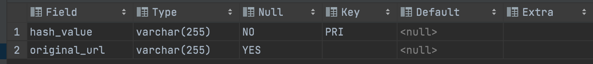

### 개발환경
java 11

MySQL

Spring Boot


### 실행방법

application.-local.properties 파일 수정 (본인 환경에 맞게)

```yaml
spring.datasource.url=jdbc:mysql://localhost:3306/urlshortener?characterEncoding=UTF-8&serverTimezone=Asia/Seoul
spring.datasource.username=root
spring.datasource.password=1234
```

#### gradle bootRun task 실행

> ./gradlew bootRun


### API 명세

> 해당 단축 URL 생성 API들은 실서버 운영이 목적이기 때문에 
> API-Key를 사용합니다.


>  사용하지 않을시에는 /url , /urls 경로의 API-Key를 사용하는 로직을 제거해주셔야 합니다.  

```java
    // 해당 Annotation 및 인자 제거
    @RequestHeader(value = "X-API-KEY") String value
    // 해당 key 유효 판별 로직 제거
    boolean validated = apiKeyService.validateKey(value);
    if (!validated) {
    return new ResponseEntity<>("API-Key가 유효하지 않습니다", HttpStatus.UNAUTHORIZED);

```

#### GET /{value}
> 해당 value의 원본 URL로 리다이렉트 합니다.
> 

#### POST /url
> x-www-form-url-encoded
> 
> key: originalUrl, value: 단축시킬 원본 url
> 
> 
##### 응답값

```json
{
  "originalUrl": "요청값",
  "value": "단축값"
}
```

#### POST /urls

> Application/json
> 
##### 요청 예시

```json
{
    "urlList": [
        {"id": 1,
            "originalUrl": "https://github.com/jay-choe/UrlShortener_Library"
        },
        {"id":2,
            "originalUrl": "https://github.com/jay-choe/ShoppingmallwithSNS"
        }
    ]
}
```

##### 응답 예시

```json
{
    "urlResponseList": [
        {
            "id": "1",
            "value": "eKBHzVx"
        },
        {
            "id": "2",
            "value": "onC3wGQ"
        }
    ]
}

```

#### DB 스키마

